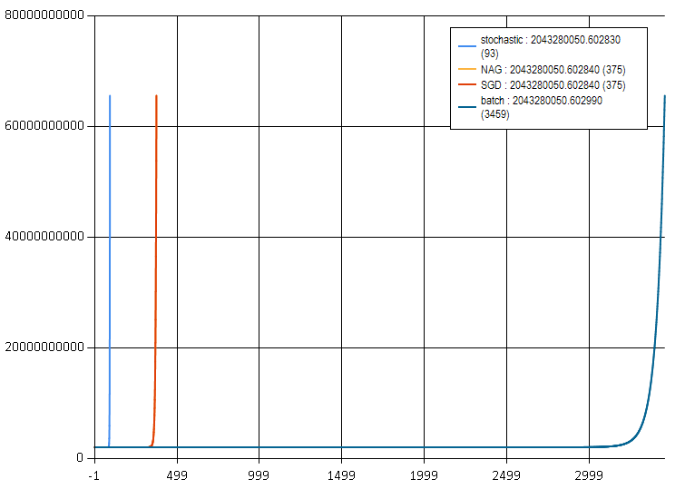
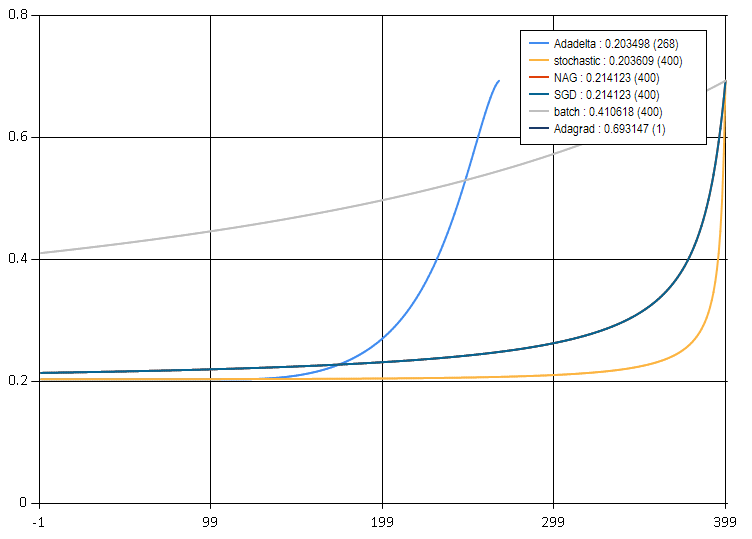
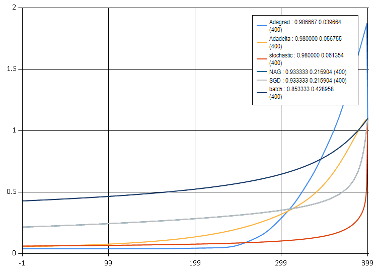
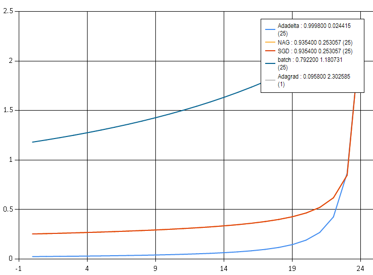

# Gradient Descent Algorithms Benchmarking

## Linear

```
data:
machine-learning-ex1\ex1\ex1data2.csv
EpochNumber = 5000 // Epochs number
BatchSize = 5
```

### Results
```
===
batch result :
 Theta = seq [340412.6596; 110631.0503; -6649.474246];
 Errors = 2043280051.0;
 CpuTime = 00:00:00.3437500;
===
stochastic result :
 Theta = seq [340412.6596; 110631.0503; -6649.474271];
 Errors = 2043280051.0;
 CpuTime = 00:00:01.1406250;
===
miniBatch result :
 Theta = seq [340412.6596; 110631.0503; -6649.474271];
 Errors = 2043280051.0;
 CpuTime = 00:00:00.3750000;
===
NAG result : {
 Theta = seq [340412.6596; 110631.0503; -6649.474271];
 Errors = 2043280051.0;
 CpuTime = 00:00:00.3750000;
===
Adagrad result :
 Theta = seq [34041264.97; 10463292.12; 5412366.356];
 Errors = 6.6544129e+14;
 CpuTime = 00:00:00.4531250;
===
Adadelta result : {
 Theta = seq [471.3843123; 470.9177804; 470.3712617];
 Errors = 6.53568707e+10;
 CpuTime = 00:00:00.4531250;
```


### Matlab

```
file: machine-learning-ex1\ex1\ex1_multi.m

Error:  2.0433 * 1.0e+09

Theta computed from gradient descent:
 340412.659574
 110631.050254
 -6649.474246
```

## Logistic

```
data:
machine-learning-ex2\ex2\ex2data1.txt
EpochNumber = 400 // Epochs number
BatchSize = 5
```

### Results
```
batch result :
 Theta = seq [0.2655236719; 0.7466021176; 0.667564853];
 Errors =  0.4106180703;
 CpuTime = 00:00:00.4375000;
===
stochastic result :
 Theta = seq [1.657147293; 3.881418549; 3.616688329];
 Errors = 0.2036090088;
 CpuTime = 00:00:16.6875000;
===
miniBatch result :
 Theta = seq [1.183114387; 2.877677255; 2.647746273];
 Errors = 0.2141232661;
 CpuTime = 00:00:03.4062500;
===
NAG result : {ResultType = EpochCountAchieved;
 Theta = seq [1.183114387; 2.877677255; 2.647746273];
 Errors = 0.2141232661;
 CpuTime = 00:00:03.3750000;
===
Adagrad result : {ResultType = NaN; }
===
Adadelta result : {ResultType = Converged;
 Theta = seq [1.718449394; 4.012902335; 3.743902863];
 Errors =  0.2034977016;
 CpuTime = 00:00:02.4375000;
 GcDelta = [58; 0; 0];}
```


### Matlab

```
file: machine-learning-ex2\ex2\ex2.m

With normalization:

Cost at theta found by fminunc: 0.203498
theta:
 1.718447
 4.012899
 3.743847

Without normalization:

Cost at theta found by fminunc: 0.203498
theta:
 -25.161272
 0.206233
 0.201470

Accuracy: 89.000000
```
> Tip
> Please notice when, do normalisation, values of the thetas will differ from one without normalisation

Interestingly, in this case I couldn't find hyper parameters which works with not normalised values.

Looks like, in this case, octave `fminunc` use Adadelta or similar algorithm.


## Softmax

```
data:
data/iris.csv
EpochNumber = 400 // Epochs number
BatchSize = 5
```

### Result

```
batch result :
 Theta = seq [ -0.1075292102; -0.4148339599; 0.440549417; -0.5967034583; ...];
 Errors = 0.4289583268;
 CpuTime = 00:00:01.0156250;
 (CpuTime = 00:00:00.5781250;)
===
stochastic result :
 Theta = seq [-0.4829995476; -2.033103842; 2.016787211; -3.609455131; ...];
 Errors = 0.06135400897;
 CpuTime = 00:00:53.5937500;
 (CpuTime = 00:00:20.2656250;)
===
miniBatch result :
 Theta = seq [-0.4200879248; -0.8605574447; 0.938587267; -1.353020664; ...];
 Errors = 0.2159036458;
 CpuTime = 00:00:03.0156250;
 (CpuTime = 00:00:01.2812500;)
===
NAG result :
 Theta = seq [-0.4200879248; -0.8605574447; 0.938587267; -1.353020664; ...];
 Errors = 0.2159036458;
 CpuTime = 00:00:03.5156250;
 (CpuTime = 00:00:01.3125000;)
===
Adagrad result :
 Theta = seq [-5.496216329; -28.48130961; 34.56551861; -40.9804075; ...];
 Errors = 0.0396638675;
 CpuTime = 00:00:03.1093750;
 (CpuTime = 00:00:01.3125000;)
===
Adadelta result :
 Theta = seq [-0.8072810257; -3.342523972; 2.455895347; -3.957274757; ...];
 Errors = 0.05675504729;
 CpuTime = 00:00:03.2031250;
 (CpuTime = 00:00:01.3281250;)
```

In parenthesis CPU time when used native MKL provider



> accuracy / error / iters

The result 0.986 clearly is overfitting.

### Tensorfolw

```
Epoch: 0397 cost= 0.231241720
Epoch: 0398 cost= 0.232853398
Epoch: 0399 cost= 0.247151194
Epoch: 0400 cost= 0.227870924
Optimization Finished!
Accuracy: 0.966667
```
Looks like `Tensorflow` use in this case simple `SGD`

## Mnist data set

5000 images, batch size = 100
Alpha = 0.01 for normalized images

Result
```
batch result :
 Theta = seq [-0.003722390691; 0.0; 0.0; 0.0; ...];
 Errors = 1.180731274;
 CpuTime = 00:00:23.6562500;
miniBatch result :
 Theta = seq [-0.04794816066; 0.0; 0.0; 0.0; ...];
 Errors = 0.2530574396;
 CpuTime = 00:03:56.0781250;
NAG result :
 Theta = seq [-0.04794816066; 0.0; 0.0; 0.0; ...];
 Errors = 0.2530574396;
 CpuTime = 00:04:05.0937500;
Adagrad result : Diverge
Adadelta result :
 Theta = seq [-0.3156164803; 0.0; 0.0; 0.0; ...];
 Errors =0.02441469104;
 CpuTime = 00:04:00.6875000;
```



> accuracy / error / iters

## Interpretation of results.

1. Batch Gradient

> Batch gradient descent is guaranteed to converge to the global minimum for convex
> error surfaces and to a local minimum for non-convex surfaces.

> Batch gradient descent performs redundant computations for large datasets,
> as it recomputes gradients for similar examples before each parameter update.

Result

Strangely, BatchGradient Gives the worst convergence to local minimum between all
algorithms and data sets.

2. Stochastic Gradient

> SGD does away with this redundancy by performing one update at a time.
> It is therefore usually much faster and can also be used to learn online.
> SGD performs frequent updates with a high variance that cause the objective
> function to fluctuate heavily.

Again, nothing similar, stochastic slowest alghoritm and there is no fluctuation

> On the other hand, this ultimately complicates convergence to the exact minimum, as SGD will keep overshooting

Hmm, SGD usually give better result than Stochastic

Very strange, it must be slower (as actual results confirm),  since instead of matrix multiplication we use iterations.

3. Mini Batch (SGD)

> a) reduces the variance of the parameter updates, which can lead to more stable convergence;
> and b) can make use of highly optimized matrix optimizations

Slower than batch, give error in the middle of stochastic and batch

4. Nesterov (NAG)

> Now that we are able to adapt our updates to the slope of our error function and speed up SGD
> in turn, we would also like to adapt our updates to each individual parameter to perform larger or smaller updates depending on their importance.

In theory should converge faster than SGD, in practice give exactly same result

5. Adagrad

> One of Adagrad's main benefits is that it eliminates the need to manually tune the learning rate. Most implementations use a default value of 0.01 and leave it at that.
> Adagrad's main weakness is its accumulation of the squared gradients in the denominator: Since every added term is positive, the accumulated sum keeps growing during training. This in turn causes the learning rate to shrink and eventually become infinitesimally small, at which point the algorithm > is no longer able to acquire additional knowledge.

In other word algorithm should converge fast then stop converging.

Logistic confirm this but Softmax not, since Adagrad give less error than Adaelta.

6. Adadelta

> Adadelta is an extension of Adagrad that seeks to reduce its aggressive, monotonically decreasing learning rate. Instead of accumulating all past squared gradients

Adadelta in theory should outperform other algos (except stochastic), in experiment it outperfom others only in case
of Logistic regression.
Softmax has very close result between Adagrad and Adadelta

Adadelta and Adagrad didnt converge on the simplest logistic regression case, perhaps
for better performance they need bigger set of data with more features.

## Resume

Though stochastic gradient show the best result for all cases, it is impractical since its iterative
nature.
Adagrad should be used as first choise, since it is fast and give good convergence to local minima.


